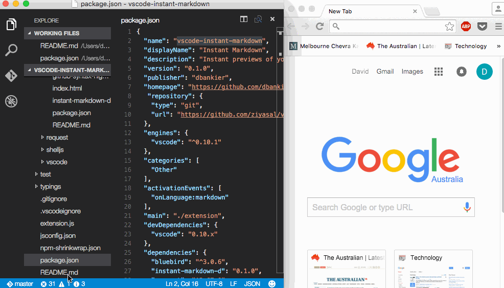

# vscode-instant-markdown

> Simply, edit markdown documents in vscode and instantly preview it in your browser.



**Note** Version 1.0 is a complete rewrite and no longer works using instant-markdown-d.

This extension is build on [markdown-it](https://github.com/markdown-it/markdown-it) and uses the following extensions:

* markdown-it-mathjax
* markdown-it-named-headers
* markdown-it-plantuml
* markdown-it-sup
* markdown-it-task-lists


## Installation

Press <kbd>F1</kbd> and narrow down the list commands by typing `extension`. Pick `Extensions: Install Extension`.
Select the `Instant Markdown` extension from the list

## Install Manual

**Mac & Linux**
```sh
cd $HOME/.vscode/extensions
git clone https://github.com/dbankier/vscode-instant-markdown.git
cd vscode-instant-markdown
npm install
```

**Windows**
```
cd %USERPROFILE%\.vscode\extensions
git clone https://github.com/dbankier/vscode-instant-markdown.git
cd vscode-instant-markdown
npm install
```

## Usage

When you edit a markdown document it should instantly preview in your browser with changes applied as you type.

You browser should automatically open to `http://localhost:8090`

### Configuration

You can turn off the automatic opening of the browser. Just change the default configuration of `instantmarkdown.autoOpenBrowser` from `true` to `false`.

You can then use `> Instant Markdown: Open Browser` to open the broswer or create a shortcut for the following command `instantmarkdown.openBrowser`.

You can turn off the automatic closing of the browser. Just change the default configuration of `instantmarkdown.autoCloseServerAndBrowser` from `true` to `false`.

You can also change the `host` and `port` that the server runs on by changing their respective default settings.


## License

MIT © [David Bankier @dbankier](https://github.com/dbankier)
[@davidbankier](https://twitter.com/davidbankier)
